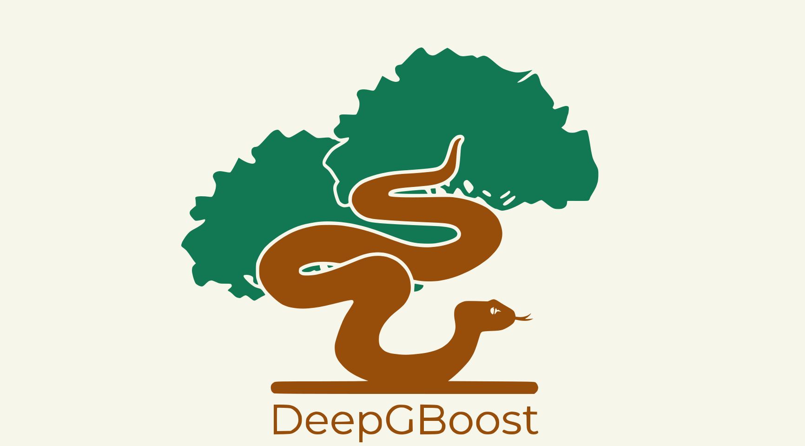
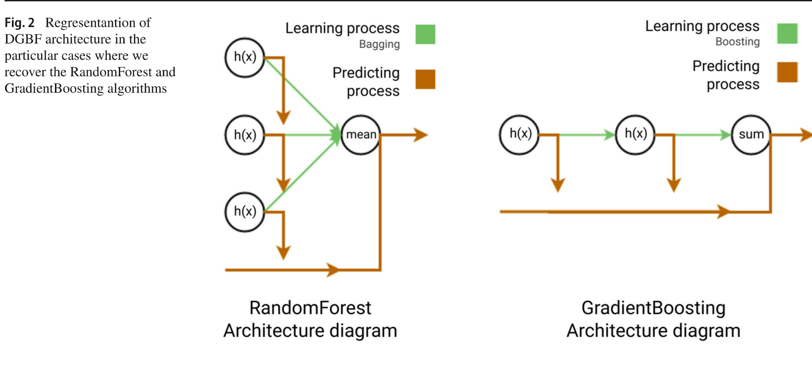

#  DeepGBoost

[](https://github.com/DelgadoPanadero/DeepGBoost/actions/workflows/ci.yml)
[](https://codecov.io/gh/DelgadoPanadero/DeepGBoost)

Machine Learning algorithm based on gradient boosting forest that merges the power of tree ensembles with neural network architectures.

<div align="center"></div>

## ⚙️ Installation

```bash
pip install deepgboost
```

To install from source with development dependencies:

```bash
pip install -e '.[dev]'
```

## 🚀 Usage

### Quick Start

```python
from sklearn.datasets import load_diabetes
from sklearn.model_selection import train_test_split
from deepgboost import DeepGBoostRegressor

X, y = load_diabetes(return_X_y=True)
X_train, X_test, y_train, y_test = train_test_split(X, y, test_size=0.2, random_state=42)

model = DeepGBoostRegressor(
    n_trees=10,
    n_layers=15,
    max_depth=4,
    learning_rate=0.1,
).fit(X_train, y_train)

predictions = model.predict(X_test)
```

### 📓 Examples

Detailed usage examples are available in the [examples/](examples/) directory:

- [quickstart.ipynb](examples/quickstart.ipynb) — full tour of the API (regression, classification, functional API, callbacks, feature importances)
- [classifier.ipynb](examples/classifier.ipynb) — binary and multiclass classification walkthrough
- [regressor.ipynb](examples/regressor.ipynb) — regression walkthrough
- [serialization.ipynb](examples/serialization.ipynb) — saving and loading trained models with pickle

## 🧠 DeepGBoost

### Algorithm

DeepGBoost implements the **Distributed Gradient Boosting Forest (DGBF)**, a novel tree ensemble algorithm introduced in:

> Delgado-Panadero, Á., Benítez-Andrades, J. A., & García-Ordás, M. T. (2023). *A generalized decision tree ensemble based on the NeuralNetworks architecture: Distributed Gradient Boosting Forest (DGBF)*. Applied Intelligence, 53, 22991–23003. https://doi.org/10.1007/s10489-023-04735-w

Classical tree ensemble methods — RandomForest (*bagging*) and GradientBoosting (*boosting*) — are powerful for tabular data but cannot perform hierarchical representation learning as Neural Networks do. DGBF addresses this by mathematically combining both bagging and boosting into a unified formulation that defines a **graph-structured tree ensemble with distributed representation learning**, without requiring back-propagation or parametric models.

The core idea is to distribute the gradient descent of each boosting step across the individual trees of a RandomForest layer, so that each tree learns an independent gradient component:

</br>

$$F_i(x) = \sum_{l=1}^{L} RF_l(x) = \frac{1}{T} \sum_{l=0}^{L} \sum_{t=0}^{T} h_{l,t}(x)$$

</br>

where *L* is the number of boosting layers and *T* is the number of trees per layer. This structure is a direct analogue of a **Dense Neural Network**, where each RandomForest layer corresponds to a network layer, with distributed gradients replacing back-propagation.


<div align="center" style="width:80%; margin:auto;">

<p><strong>Fig. 1</strong> — <strong>NeuralNetwork vs DGBF architecture</strong>: In NN (left), each neuron's output feeds into the next layer via back-propagation. In DGBF (right), the distributed gradients of all trees from each layer are forwarded to every tree of the following layer.</p>
</div>

Both RandomForest and GradientBoosting emerge naturally as special cases of DGBF: RandomForest is recovered with a single layer (*L* = 1) and GradientBoosting with a single tree per layer (*T* = 1).


<div align="center" style="width:80%; margin:auto;">

<p><strong>Fig. 2</strong> — <strong>RandomForest & GradientBoosting as DGBF special cases</strong>: RandomForest (left) and GradientBoosting (right) represented as particular graph architectures of DGBF.</p>
</div>

### 📊 Benchmark

DGBF was evaluated against RandomForest (RF) and GradientBoosting (GBDT) on 9 regression datasets from the UCI Machine Learning Repository (Parkinson, Wine, Concrete, Obesity, NavalVessel, Temperature, Cargo2000, BikeSales, Superconduct), using 200 randomized simulations per dataset with an 80/20 train-test split.

<div align="center"></div>

> [!note] **Winner DeepGBoost**
> 🏆 DGBF surpasses the mean R² score of both GradientBoosting and RandomForest in 7 out of 9 datasets

To reproduce the benchmark, run the experiment script from the `benchmark/` directory:

```bash
cd benchmark
python run_experiments.py
```

The script reads its configuration from `benchmark/config.json`, where you can adjust the models, hyperparameters, datasets, and experiment settings (e.g. number of bootstrap runs). Results are saved to `benchmark/results/`.

## 🤝 Contributing

Contributions are welcome. To get started:

1. Fork the repository and create a branch from `main`.
2. Install development dependencies: `pip install -e '.[dev]'`
3. Make your changes and add tests as needed.
4. Run the test suite: `pytest`
5. Open a pull request describing what you changed and why.

Please open an issue first for significant changes so the approach can be discussed before implementation.

## 📄 Citation

If you use DeepGBoost in your research, please cite the original paper:

```bibtex
@article{delgado2023dgbf,
  author  = {Delgado-Panadero, {\'A}ngel and Ben{\'i}tez-Andrades, Jos{\'e} Alberto and Garc{\'i}a-Ord{\'a}s, Mar{\'i}a Teresa},
  title   = {A generalized decision tree ensemble based on the {NeuralNetworks} architecture: {Distributed Gradient Boosting Forest (DGBF)}},
  journal = {Applied Intelligence},
  volume  = {53},
  pages   = {22991--23003},
  year    = {2023},
  doi     = {10.1007/s10489-023-04735-w}
}
```
