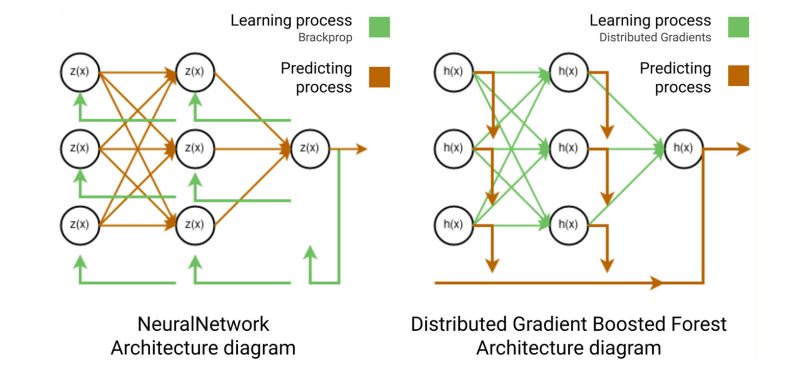
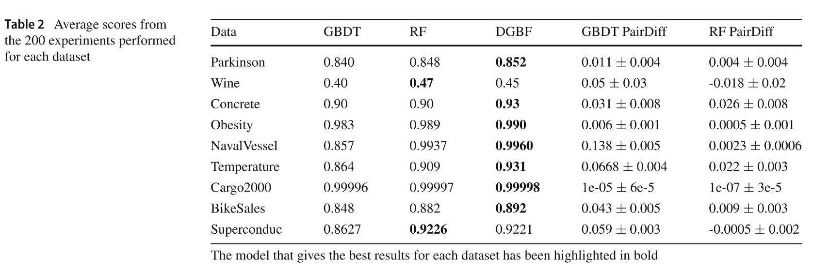

# DeepGBoost

[](https://pypi.python.org/pypi/deepgboost/)
[](https://github.com/delgadopanadero/deepgboost/actions/workflows/ci.yml)
[](https://github.com/delgadopanadero/deepgboost/blob/main/LICENSE)

Machine learning algorithm based on gradient boosting forest that merges the power of tree ensembles with neural network architectures.

<div align="center"></div>

## Algorithm

DeepGBoost implements the **Distributed Gradient Boosting Forest (DGBF)**, introduced in:

> Delgado-Panadero, A., Benitez-Andrades, J. A., & Garcia-Ordas, M. T. (2023). *A generalized decision tree ensemble based on the NeuralNetworks architecture: Distributed Gradient Boosting Forest (DGBF)*. Applied Intelligence, 53, 22991-23003. <https://doi.org/10.1007/s10489-023-04735-w>

Classical tree ensemble methods — RandomForest (*bagging*) and GradientBoosting (*boosting*) — cannot perform hierarchical representation learning the way neural networks do. DGBF addresses this by combining both approaches into a unified formulation that defines a **graph-structured tree ensemble with distributed representation learning**, without requiring back-propagation or parametric models.

The ensemble prediction is:

$$F(x) = \sum_{l=1}^{L} RF_l(x) = \frac{1}{T} \sum_{l=0}^{L} \sum_{t=0}^{T} h_{l,t}(x)$$

where *L* is the number of boosting layers and *T* is the number of trees per layer. Each RandomForest layer is the analogue of a dense network layer, with distributed gradients replacing back-propagation.

RandomForest (*L* = 1) and GradientBoosting (*T* = 1) are recovered as special cases.

<div align="center">
  
  <p><strong>Fig. 1</strong> — NeuralNetwork vs DGBF architecture</p>
</div>

<div align="center">
  
  <p><strong>Fig. 2</strong> — RandomForest & GradientBoosting as DGBF special cases</p>
</div>

<div align="center">
  
  <p><strong>Fig. 3</strong> — Benchmark results across 9 UCI datasets</p>
</div>

## Installation

```bash
pip install deepgboost
```

Optional plotting support:

```bash
pip install deepgboost[plotting]
```

Install from source with development dependencies:

```bash
git clone https://github.com/delgadopanadero/deepgboost.git
cd deepgboost
pip install -e ".[dev]"
```

## Quick Start

**Regression**

```python
from sklearn.datasets import load_diabetes
from sklearn.model_selection import train_test_split
from deepgboost import DeepGBoostRegressor

X, y = load_diabetes(return_X_y=True)
X_train, X_test, y_train, y_test = train_test_split(X, y, test_size=0.2, random_state=42)

model = DeepGBoostRegressor(n_trees=10, n_layers=10, max_depth=4, learning_rate=0.1)
model.fit(X_train, y_train)
print(model.score(X_test, y_test))
```

**Classification**

```python
from sklearn.datasets import load_breast_cancer
from deepgboost import DeepGBoostClassifier

X, y = load_breast_cancer(return_X_y=True)
X_train, X_test, y_train, y_test = train_test_split(X, y, test_size=0.2, random_state=42)

clf = DeepGBoostClassifier(n_trees=10, n_layers=10, learning_rate=0.1)
clf.fit(X_train, y_train)
print(clf.score(X_test, y_test))
```

**Early stopping with callbacks**

```python
from deepgboost import DeepGBoostRegressor, EarlyStoppingCallback, EvaluationMonitorCallback

model = DeepGBoostRegressor(n_trees=5, n_layers=20, learning_rate=0.05)
model.fit(
    X_train, y_train,
    eval_set=[(X_test, y_test)],
    callbacks=[EvaluationMonitorCallback(period=5), EarlyStoppingCallback(rounds=10)],
)
```

## Citation

```bibtex
@article{delgado2023dgbf,
  author  = {Delgado-Panadero, {\'A}ngel and Ben{\'i}tez-Andrades, Jos{\'e} Alberto and Garc{\'i}a-Ord{\'a}s, Mar{\'i}a Teresa},
  title   = {A generalized decision tree ensemble based on the {NeuralNetworks} architecture: {Distributed Gradient Boosting Forest (DGBF)}},
  journal = {Applied Intelligence},
  volume  = {53},
  pages   = {22991--23003},
  year    = {2023},
  doi     = {10.1007/s10489-023-04735-w}
}
```
